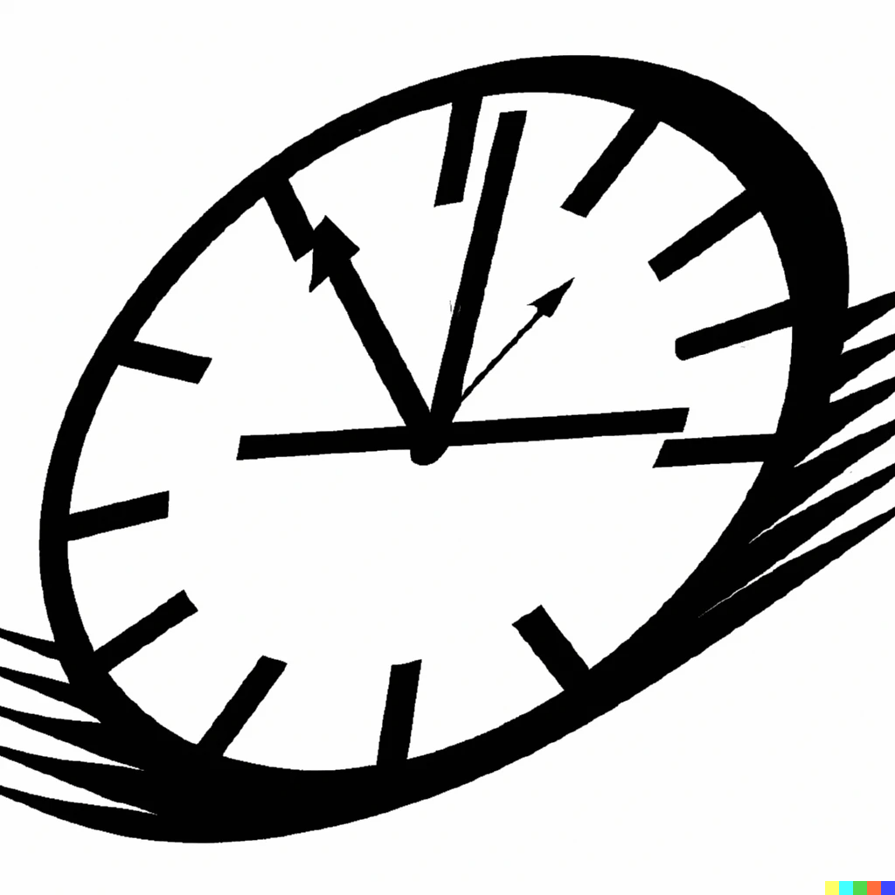

# Time-Tide
A web based, Time management, activity planning, reporting of hours worked. Created as mobile first Progressive Web App, Single Page Application in Angular and microservices in dotnet core using Clean Architecture and Domain Driven Design and deployed as Azure Static Web App and Container Apps using Azure Sql Server Cloud

[![Contributors][contributors-shield]][contributors-url]
[![Forks][forks-shield]][forks-url]
[![Stargazers][stars-shield]][stars-url]
[![Issues][issues-shield]][issues-url]
[![AGPL3 License][license-shield]][license-url]


<!-- PROJECT LOGO -->
<br />
<div align="center">
  <a href="https://github.com/emidiomorgia/time-tode">
    
  </a>

  <h3 align="center">Time Tide</h3>

  <p align="center">
    A time management web based application
    <br />
    <a href="https://github.com/emidiomorgia/time-tide"><strong>Explore the docs »</strong></a>
    <br />
    <br />
    <a href="https://github.com/emidiomorgia/time-tide">View Demo</a>
    ·
    <a href="https://github.com/emidiomorgia/time-tide/issues">Report Bug</a>
    ·
    <a href="https://github.com/emidiomorgia/time-tide/issues">Request Feature</a>
  </p>
</div>


<!-- TABLE OF CONTENTS -->
<details>
  <summary>Table of Contents</summary>
  <ol>
    <li>
      <a href="#about-the-project">About The Project</a>
      <ul>
        <li><a href="#built-with">Built With</a></li>
      </ul>
    </li>
    <li>
      <a href="#getting-started">Getting Started</a>
      <ul>
        <li><a href="#prerequisites">Prerequisites</a></li>
        <li><a href="#installation">Installation</a></li>
      </ul>
    </li>
    <li><a href="#usage">Usage</a></li>
    <li><a href="#roadmap">Roadmap</a></li>
    <li><a href="#contributing">Contributing</a></li>
    <li><a href="#license">License</a></li>
    <li><a href="#contact">Contact</a></li>
    <li><a href="#acknowledgments">Acknowledgments</a></li>
  </ol>
</details>


<!-- ABOUT THE PROJECT -->
## About The Project

[![Product Name Screen Shot][product-screenshot]](https://time-tide.morgia.info)

A web based, Time management, activity planning, reporting of hours worked. Created as mobile first Progressive Web App, Single Page Application in Angular and microservices in dotnet core using Clean Architecture and Domain Driven Design and deployed as Azure Static Web App and Container Apps using Azure Sql Server Cloud

<p align="right">(<a href="#readme-top">back to top</a>)</p>


### Built With

A list of major frameworks/libraries, design and architecture pattern used in this project.

* Dotnet
* Angular
* Microservices
* Clean Architecture
* Domain Driven Design

<p align="right">(<a href="#readme-top">back to top</a>)</p>


<!-- GETTING STARTED -->
## Getting Started
<!-- 
This is an example of how you may give instructions on setting up your project locally.
To get a local copy up and running follow these simple example steps.

### Prerequisites

This is an example of how to list things you need to use the software and how to install them.
* npm
  ```sh
  npm install npm@latest -g
  ```

### Installation

_Below is an example of how you can instruct your audience on installing and setting up your app. This template doesn't rely on any external dependencies or services._

1. Get a free API Key at [https://example.com](https://example.com)
2. Clone the repo
   ```sh
   git clone https://github.com/your_username_/Project-Name.git
   ```
3. Install NPM packages
   ```sh
   npm install
   ```
4. Enter your API in `config.js`
   ```js
   const API_KEY = 'ENTER YOUR API';
   ``` -->

<p align="right">(<a href="#readme-top">back to top</a>)</p>


<!-- USAGE EXAMPLES -->
## Usage

<!-- Use this space to show useful examples of how a project can be used. Additional screenshots, code examples and demos work well in this space. You may also link to more resources.

_For more examples, please refer to the [Documentation](https://example.com)_ -->

<p align="right">(<a href="#readme-top">back to top</a>)</p>


<!-- ROADMAP -->
## Roadmap

- [x] Project setup
- [x] Azure deploy with GitHub Actions


See the [open issues](https://github.com/emidiomorgia/time-tide/issues) for a full list of proposed features (and known issues).

<p align="right">(<a href="#readme-top">back to top</a>)</p>


<!-- CONTRIBUTING -->
## Contributing

Contributions are what make the open source community such an amazing place to learn, inspire, and create. Any contributions you make are **greatly appreciated**.

If you have a suggestion that would make this better, please fork the repo and create a pull request. You can also simply open an issue with the tag "enhancement".
Don't forget to give the project a star! Thanks again!

1. Fork the Project
2. Create your Feature Branch (`git checkout -b feature/AmazingFeature`)
3. Commit your Changes (`git commit -m 'Add some AmazingFeature'`)
4. Push to the Branch (`git push origin feature/AmazingFeature`)
5. Open a Pull Request

<p align="right">(<a href="#readme-top">back to top</a>)</p>


<!-- LICENSE -->
## License

Distributed under the AGPL3 License. See `LICENSE.txt` for more information.

<p align="right">(<a href="#readme-top">back to top</a>)</p>


<!-- CONTACT -->
## Contact

Emidio Morgia - emidio@morgia.info

Project Link: [https://github.com/emidiomorgia/time-tide](https://github.com/emidiomorgia/time-tide)

<p align="right">(<a href="#readme-top">back to top</a>)</p>


<!-- ACKNOWLEDGMENTS -->
## Acknowledgments

<p align="right">(<a href="#readme-top">back to top</a>)</p>


<!-- MARKDOWN LINKS & IMAGES -->
<!-- https://www.markdownguide.org/basic-syntax/#reference-style-links -->
[contributors-shield]: https://img.shields.io/github/contributors/emidiomorgia/time-tide.svg?style=for-the-badge
[contributors-url]: https://github.com/emidiomorgia/time-tide/graphs/contributors
[forks-shield]: https://img.shields.io/github/forks/emidiomorgia/time-tide.svg?style=for-the-badge
[forks-url]: https://github.com/emidiomorgia/time-tide/network/members
[stars-shield]: https://img.shields.io/github/stars/emidiomorgia/time-tide.svg?style=for-the-badge
[stars-url]: https://github.com/emidiomorgia/time-tide/stargazers
[issues-shield]: https://img.shields.io/github/issues/emidiomorgia/time-tide.svg?style=for-the-badge
[issues-url]: https://github.com/emidiomorgia/time-tide/issues
[license-shield]: https://img.shields.io/github/license/emidiomorgia/time-tide.svg?style=for-the-badge
[license-url]: https://github.com/emidiomorgia/time-tide/blob/master/LICENSE.txt
[product-screenshot]: images/screenshot.png
[Angular.io]: https://img.shields.io/badge/Angular-DD0031?style=for-the-badge&logo=angular&logoColor=white
[Angular-url]: https://angular.io/
[Bootstrap.com]: https://img.shields.io/badge/Bootstrap-563D7C?style=for-the-badge&logo=bootstrap&logoColor=white
[Bootstrap-url]: https://getbootstrap.com
[JQuery.com]: https://img.shields.io/badge/jQuery-0769AD?style=for-the-badge&logo=jquery&logoColor=white
[JQuery-url]: https://jquery.com 
